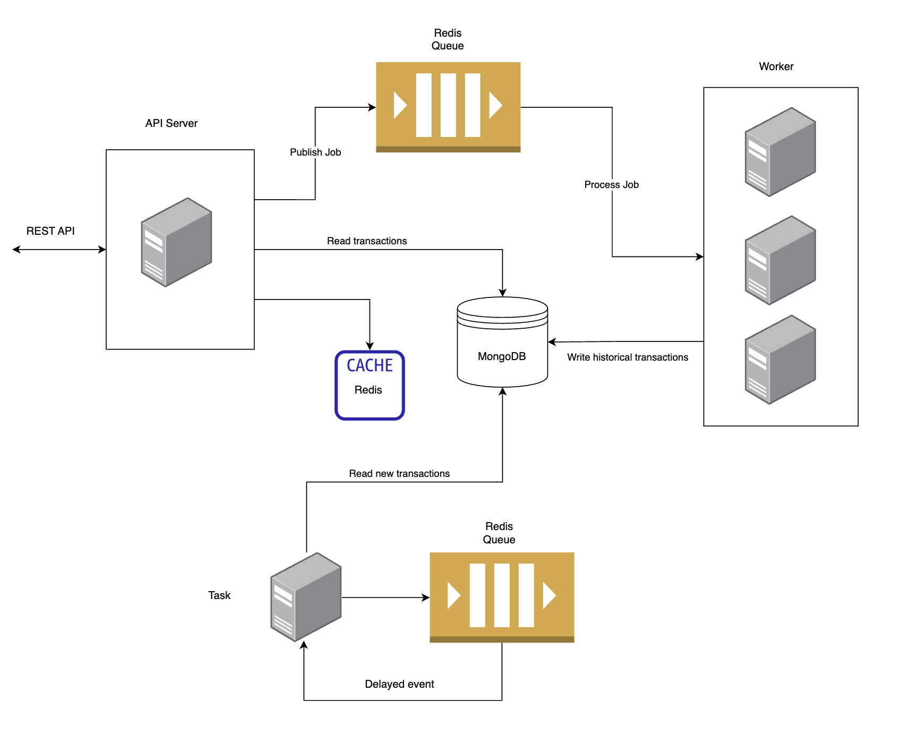
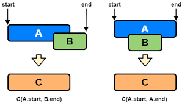
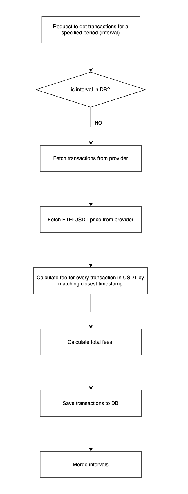

# Introduction

Vega Solutions Engineering Challenge 1

This is the code repo for the backend server. It is built with Typescript and NestJS framework.
https://nestjs.com

# Getting Started

## Prerequisites

Please make sure you have the following installed:

1. Node ( version >= 16 )
2. Docker

## Initial Setup

1. Clone this repo
2. Open a terminal and navigate to the source folder, then run: `npm i` to install the necessary packages

## Build and Run (docker-compose)

Run the following from the terminal at the source folder

```
docker compose up --build
```

To scale the number of workers to 3 instances:
```
docker compose up --build --scale worker:3
```

This will build the image spin up the following resources:

- REST API server (http://localhost:3001)
- Worker service (to perform historical transaction recording)
- Task service (to continuously record latest transaction info)
- MongoDB
- Redis

Please make sure to close any other programs using the same port 3001

## Testing
Unit tests are written for services, controllers, and providers. Run the below command in the root folder to run all tests
```
npm run test
```

## Developing

For developing the code, use the following commands:

- `npm run start:dev`(start the API server)
- `npm run start:worker`(start the Worker service)
- `npm run start:task`(start the Task service)

# REST API Documentation

Run the API servier

`npm run start:dev`

Open up http://localhost:3001/api 


# Architectural Design 


## Functional Requirements
The 3 main requirements of this assignment are:
1. A REST API server to communicate with the frontend
2. Process batch jobs to retrieve and store historical data for a given time period
3. Continuously record new transactions

## Priciples and Techniques

### Horizontal Scaling
Separate containers for handling the 3 requirements above

The REST API server will receive a request to retrieve historical data, publish a job to a queue, which gets picked up by a Worker service to be processed.

Since Worker services are compute heavy, they are run as separate container(s) as we need it to scale horizontally, independantly.

We can then have only 1 instance of the Task service to record new transactions, since there having more of them does not help.

The REST API server can also be horizontally scaled to more instances, and load balanced during heavy traffic independantly.

### Caching
An in memory cache (redis) is used to store the latest price of ETH/USDT, since it is not practical to query a 3rd party API for every single request from all users.  

### Queueing
Redis queues are used here for both batch jobs and fetching new transaction data for its simplicity.

The Task service runs approximately every 10 seconds, and it does so by pushing a 10s delayed event to the queue everytime upon completion of fetching new transactions. This approach is preferrable compared to a cron job because:

- Free 3rd party APIs can sometimes have high latency   
- Spike in transaction data, which increases the latency of 3rd party APIs

In doing so, we can avoid the situation where a new task runs even when the previous task is still processing, causing us to be rate limited by 3rd party APIs

### Single Responsibility
There are 2 domains for the problem:
1. Transactions
2. Exchange rate (for converting ETH to USDT)

Hence they are separated into 2 groups with its own service and controller within the repo

### Dependancy Inversion
There are many data providers for uniswap transactions and eth prices, with different capabilities and API. They are abstracted into `ITransactionProvider` abd `IExchangeRateProvider` respectively.

So that high level modules depend on these interfaces instead of low level modules, and we can keep adding providers which conform to the interfaces in the future, and switch them easily.

### Dependancy Injection
NestJS Framework was chosen mainly due its batteries included nature, as well as its heavy use of inversion of control (IOC) container for dependancy injection

Below is the dependancy diagram of the 3 services


The benefit of this is that we can spin up different types of components with different configurations easily, all within a single code base.

For example: In `TransactionService` class, we can encapsulate all the logic of reading and writing transactions within 1 class, although used by 3 different components. This approach has better cohesion, avoids code duplication and conforms to single responsibility priciple in managing transactions.

Because dependancy inversion principle was followed, we can also inject different data providers for different components. For example:
we use different transactions provider for `Task` and and `Worker` so as not to exceed the API rate limits by the providers.

### Rate limiting
Endpoints are rate limited to 200 requests/minute to protect our servers from overloading.

### Data Interval Tracking

Whenever the user submits a request to get transactions for a time period (interval), we go through an expensive operation of pulling the data, and saving them to database. If theres a subsequent request falls into 1 of the existng intervals, we know that we do not need to recompute again.

Intervals that overlap will be merged with the algorithm used to solve https://leetcode.com/problems/merge-intervals/





### Using bignumber.js
Since ethereum gas fees are denoted in `wei`, the numbers can be huge when we perform math operations on them. Hence we use `bignumber.js` to perform fixed point calculations.

>a mistake was made in the database field naming, should have named `wei` instead of `eth`

# Limitations & Known Issues
1. Unable to search for specific hash within a time range
2. Gas fees are wrong from thegraph API (only found out at the very end :/)
3. Test coverage is not high enough, no integration tests. (not enough time)

# Future Improvements
1. Worker to emit progress events, which we can then show a progress bar with 
3. Load balancer for API server
4. Data Access Object
6. Database in cluster mode, with more relicas for reading 
7. cache latest transactions, report
10. Better merging of intervals, right now we still fetch data for the whole interval even when there is an overlap

# References
https://octo-woapi.github.io/cookbook/asynchronous-api.html

https://docs.uniswap.org/api/subgraph/overview